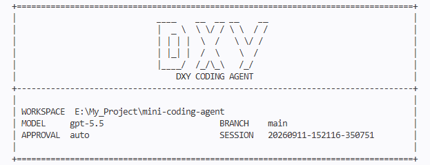

# Code_Harness



Code_Harness 是一个轻量级命令行编码 Agent。它可以读取本地项目结构、搜索代码、读写文件、执行受限 Shell 命令，并通过 OpenAI 兼容或 Anthropic 兼容的模型接口完成代码修改任务。

## 环境配置

先在项目根目录创建 `.env` 文件。可以参考 `.env.example`，最少需要配置：

```env
LLM_PROVIDER=openai
OPENAI_BASE_URL=https://your-api-base-url
OPENAI_API_KEY=your-api-key
LLM_MODEL=your-model
LLM_WIRE_API=responses
LLM_TOOL_MODE=prompt
```

## 运行方式

在项目根目录运行：

```powershell
python -m cli
```

## 常用参数

指定要操作的项目目录：

```powershell
python -m cli --cwd E:\Some\OtherProject
```

查看完整命令行参数：

```powershell
python -m cli --help
```
